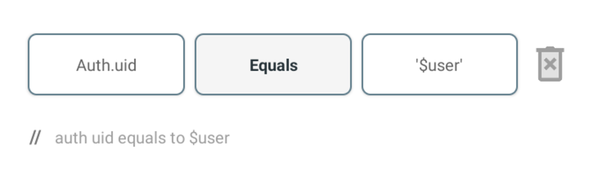

# RulesGuard

## Welcome

The Firebase Realtime Database \(aka "the RTDB"\) is the original database that shot Firebase onto the scene in 2012.

The RTDB was one of the first "serverless" datastores on the market, competing directly with Parse and eventually with RethinkDB's Horizon project.

 The Firebase Realtime Database is **a cloud-hosted NoSQL database that lets you store and sync data between your users in realtime**. NEW: Cloud Firestore enables you to store, sync and query app data at global scale.

We Created RuleGuard to Enable you write security rules for your project.

RuleGuard  lets you write Firebase Database Realtime security rules for your  apps using simple  blocks. This Blocks  lets you go beyond writing your database rues from scratch, allowing your application  and database rules to be flexible, easy to read and scalable.

### //On Firebase Console

```
{
  "rules": {
  "users": {
      ".read": "auth.uid === $user",
      ".write": "auth.uid === $user"
    }
  }
}
```


### //On Rule Guard




 This is a little more easier to understand for average users who dont know much about firebase rules syntax.


Once you're strong enough, save the world:


```bash
# Ain't no code for that yet, sorry
echo 'You got to trust me on this, I saved the world'
```



