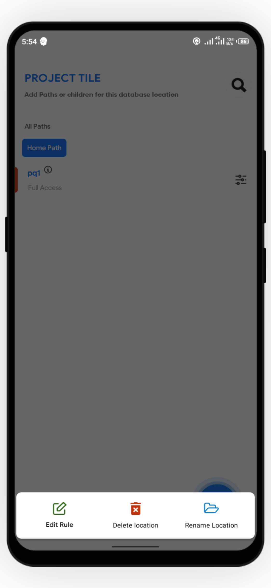

# Adding Security Rules

You can add security rules using the editor section of the app. You can access the editor page  by first adding a `path/location`  inside your database project. and clicking on the small menu icon beside the project.




By default, every newly created project will be on `locked mode` \(no one can access such database location\).

To Add Your custom Rules, click `Custom access`. This will enable you to add custom rules for both read and write permissions for your `path/location`.For example, to add specifically for read permission you can select one of the three

* Locked Mode - This stops all read access to your database. Meaning , nobody \(including  you\) can view content of this path to edit it.

```javascript
//similar to
".read":false;
```

* Allow Access - This allows access to all users. Highly Insecure.


This is a **Highly Unrecommended** approach as it grants any user access to such database path


* Custom Access - This is highly recommended as it allows you to add custom rules for only read permission


By clicking on The small icon beside the `custom Access`, you can access the custom editor. If you want to learn more about the available rule syntax, [CLICK HERE](../editor-syntax/intro.md).

For those who are still yet to understand, we have provided simple code snippets in the editor, Just Below in the smart rule section.

