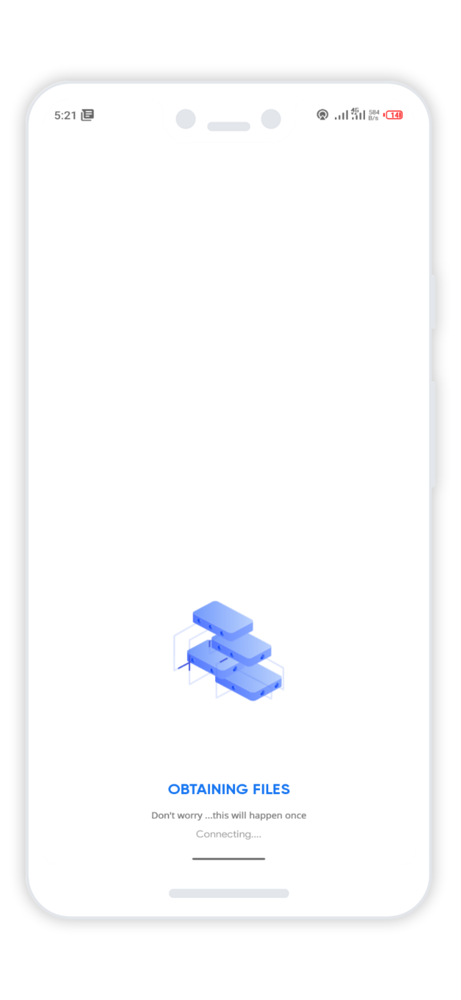
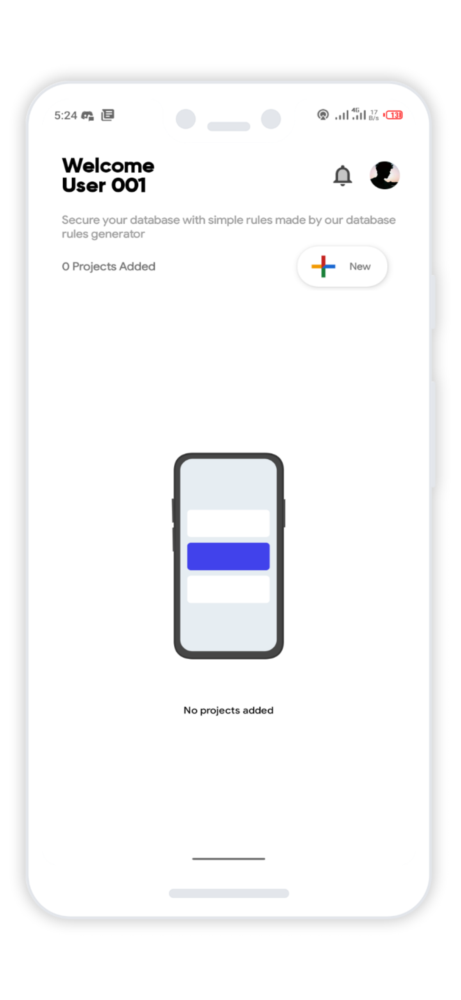
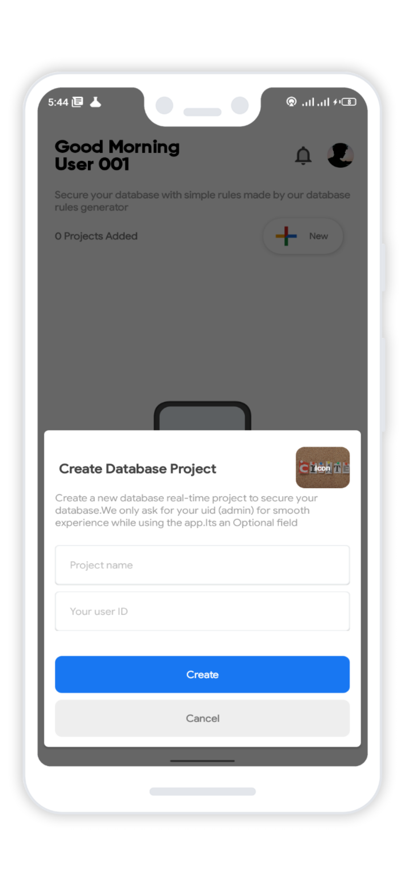

# Creating Your Database Project

 When you first Start RuleGuard. Click on the `Add button` On the Top Left button, and give RuleGuard permissions to read and write to storage. 

After that you will be welcome to the main project tab

#### 

### Adding A Project

Click On the `add button` on the top left of the screen to add your project

You only need to set the **name** for your project and project `userid (optional)` for the database. Here is a full list of the settings you can change:

1. `Icon` - Tap on the Image to change the icon for your project. This is entirely optional
2. `Project Name` - Name of the application/website that you are making database rules for.
3. `Project user id` - user id for the database admin/owner. This is need for proper functioning and ease while generating. It is optional.

### Creating a New Project

After filling out the necessary information, click on `Create` to create a new project.

